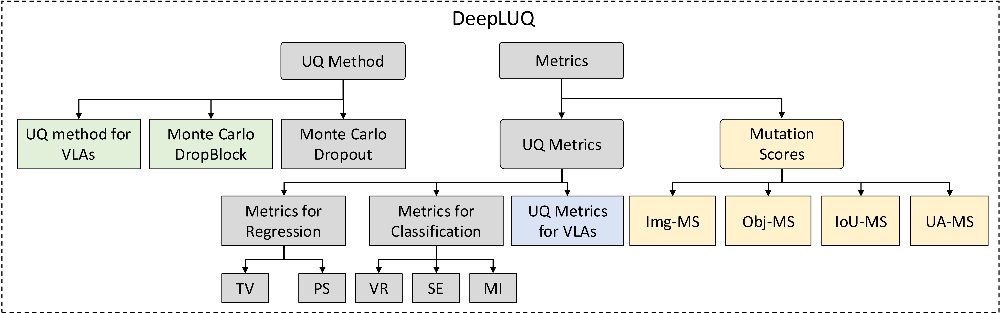

# DeepLUQ: Python Library for Deep Learning Uncertainty Quantification

## Introduction

This library provides methods and metrics for capturing and quantifying uncertainty in deep learning models. It currently includes Monte Carlo Dropout (MC-Dropout) as the UQ method for capturing uncertainties in model predictions. The library integrates various UQ metrics to quantify uncertainties of two common deep-learning tasks, i.e., regression and classification.

## Installation

## Acknowledgement

DeepLUQ is supported by the RoboSAPIENS project funded by the European Commission's Horizon Europe programme under grant agreement number 101133807.

[//]: # (## Case Study Applications)

[//]: # ()
[//]: # (### Assessing the Uncertainty and Robustness of the Laptop Refurbishing Software)

[//]: # ()
[//]: # (Github repository: https://github.com/chengjie-lu/sticker-detection-uncertainty-quantification)

[//]: # ()
[//]: # (Paper: Chengjie Lu, Jiahui Wu, Shaukat Ali, and Mikkel Labori Olsen. "Assessing the Uncertainty and Robustness of the Laptop Refurbishing Software". In 18th IEEE International Conference on Software Testing, Verification and Validation &#40;ICST&#41; 2025. [Preprint]&#40;https://arxiv.org/pdf/2409.03782&#41;)

[//]: # ()
[//]: # (### Evaluating Uncertainty and Quality of Visual Language Action-enabled Robots)

[//]: # ()
[//]: # (Github repository: https://github.com/pablovalle/VLA_UQ)

[//]: # ()
[//]: # (Paper: Valle, Pablo, Chengjie Lu, Shaukat Ali, and Aitor Arrieta. "Evaluating Uncertainty and Quality of Visual Language Action-enabled Robots." arXiv preprint arXiv:2507.17049 &#40;2025&#41;. [Preprint]&#40;https://arxiv.org/pdf/2507.17049&#41;)

[//]: # (## References)

[//]: # ()
[//]: # (Gal, Yarin, and Zoubin Ghahramani. "Dropout as a bayesian approximation: Representing model uncertainty in deep learning." international conference on machine learning. PMLR, 2016.)

[//]: # ()
[//]: # (Gal, Yarin. "Uncertainty in deep learning." &#40;2016&#41;.)

[//]: # ()
[//]: # (Catak, Ferhat Ozgur, Tao Yue, and Shaukat Ali. "Prediction surface uncertainty quantification in object detection models for autonomous driving." 2021 IEEE International Conference on Artificial Intelligence Testing &#40;AITest&#41;. IEEE, 2021.)
